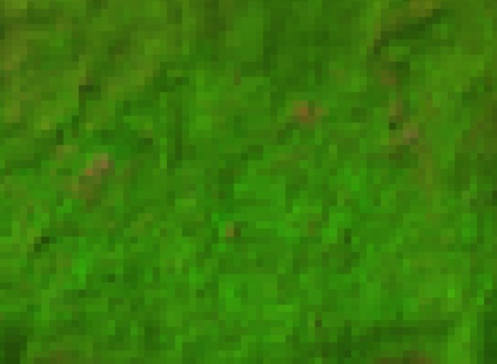

# Mangrove forest

| Legend | Level | Class Number | Color Code |
| ------ | ----- | -------------| ---------- |
| Mangrove Forest | 1.1 | x | #xxxxx |

## Definition

Mangroves are ecosystems that exist between the land and the sea and are found in tropical and subtropical intertidal zones and have a lot of salt-tolerant plants. These ecosystems exhibit high rainfall (2 100 to 6000 mm per year). Source: [India State of Forest Report, 2023, Chapter 3](https://fsi.nic.in/uploads/isfr2023/isfr_book_eng-vol-1_2023.pdf).

## Description

*Add notes here*

 ## Examples

### Western Ghats

*Add notes about region here.*

*Specify lat-lon of sample*

| Satellite | Landsat (RGB) | Landsat (SWIR1/NIR/RED) |
|-----------|---------------|-------------------------|
*To change to images here - Take Sundarban images instead*
|  |  |  |

*Add Link to Google Maps*

### Himalayas

*Add notes about region here.*

## Sample Collection Tips

Use reference maps such as:

Global Mangrove Forests Distribution, v1 (2000) - [GEE script](https://code.earthengine.google.co.in/4c2e5fa9a65c5182d4ec02a1971f99a3)

*To add other reference maps*
