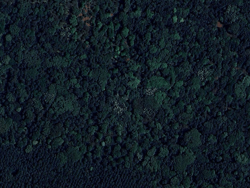
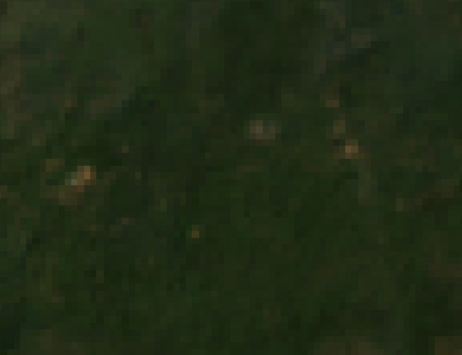
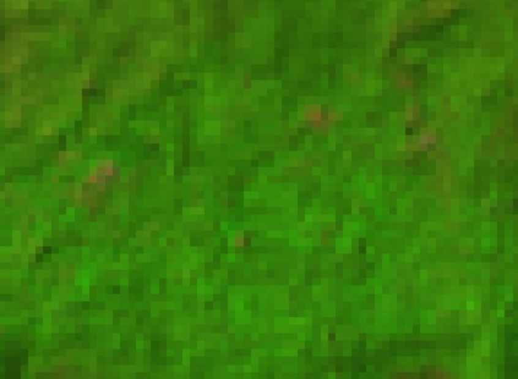

# Evergreen Forests

| Legend | Level | Class Number | Color Code |
| ------ | ----- | -------------| ---------- |
| Evergreen Forest | 1.2 | 3 | ##1f8d49 |

## Definition

Forest comprising of thick and dense canopy of tall trees, which predominantly remain green throughout the year. It includes both coniferous and tropical broad-leaved evergreen trees. 

## Description

 Evergreen forests are landcover types characterized by dense tree canopy cover where the majority of trees retain their leaves throughout the year. In landcover classification, evergreen forests are identified by persistent green foliage, minimal seasonal leaf loss, and a closed canopy structure. They are distinguished from deciduous forests by their year-round photosynthetic activity and stable canopy appearance.

 ## Examples

### Western Ghats

*Add notes about region here.*

| Satellite | Landsat (RGB) | Landsat (SWIR1/NIR/RED) |
|-----------|---------------|-------------------------|
|  |  |  |

*Add Link to Google Maps*

### Himalayas

*Add notes about region here.*

## Sample Collection Tips

Use both dry and median mosaics to determine if the forest is evergreen. 

TO ADD: Give link to script for dry and median mosaics
