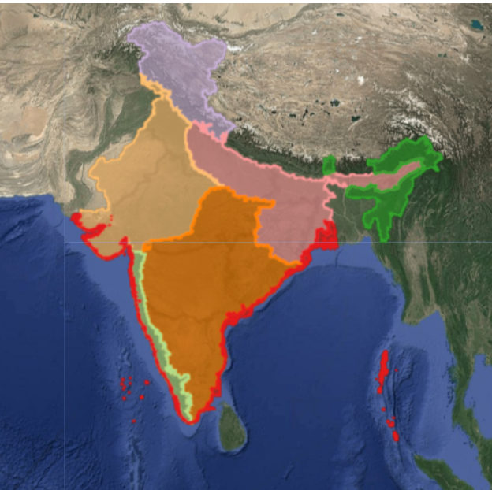

# IOLN Class Reference

This work for the class reference for the Open Landcover Mapping for India is adapted from the [Brazilian Mapbiomas Interpretation Keys](https://chave.lapig.iesa.ufg.br/en/)

The aim is twofold:

1. Come up for a definition for the different classes that are relevant for the Indian context and this for across the biogeographic regions.

2. How to identify these classes using True Color Composities (TCC), False Color Composites (FCC), reference maps or other (Interpretation Keys).

3. Identify if there are a regional differences in definition (if any) of the classes and/or interpretation keys.  

The seven biogeographic regions for India ([code](https://code.earthengine.google.co.in/baa462996f2986bf5d4690532a2c1c29) - Pradeep Koulgi) identified (TO DO: Put legend in GEE code):
*TO DO: Add this to the legend of the code*

- Himalayas

- Indo-Gangetic Plains

- Arid Central India + The Indian Desert

- Western Ghats

- Peninsula Plateau + East Central Highlands

- North-East Hills

- Islands + Coasts

## Generic code

With this code, you have - IN PROGRESS - URGENT (issue/task)

- A way to take the screenshots in GEE using TCC and FCC

- Get the True and False Color Composites for a past and present year (including the dry and wet seasons)

## Additional tools:

- [Google Earth Pro](https://www.google.com/intl/en_in/earth/about/versions/#earth-for-web) - You can use for screenshots 

- Reference maps to use in the interpretation keys - Collaborate with seperate working group for this

## Example

A full example for one class can be found here - IN PROGRESS - URGENT

For each class/region this may look different of course

## [References/resources](docs)

